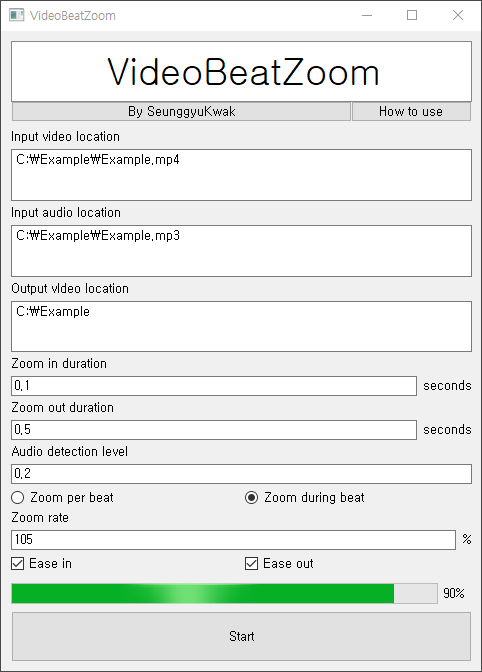

# VideoBeatZoom
자동으로 영상의 악기에 맞춰서 줌을 해주는 프로그램이다.

    

 

## 사용 예시
<video controls>
  <source src="https://youtu.be/LyBvaqn7ue0" type="video/mp4">
</video>

[원본](https://youtu.be/h-fTRnXhC4M)

 

## 사용방법
1. 줌 할 영상의 경로를 입력한다.
2. 외부 프로그램을 사용해 오디오에서 감지되고자 하는 악기만 따로 분리한다.
3. 줌 된 영상이 저장될 경로를 입력한다.
4. 줌 인이 지속되는 시간을 입력한다.
5. 줌 아웃이 지속되는 시간을 입력한다.
6. 오디오에서 악기를 감지할 음량를 입력한다. (기본값 0.2)
7. 매 비트마다 줌 / 비트가 지속되는 동안 줌 중에 선택한다.
8. 줌 아웃 또는 줌 인에 이징 유무를 선택한다.
9. 시작 버튼을 누른다.

 

    

위의 창의 나타난다면 <code>기존파일명-zoomed.mp4</code>로 저장이 완료된 것이다.

 

## 주의사항
<code>Input audio location</code>란에는 미리 특정 악기만 따로 분리한 오디오의 경로를 입력해야 한다.  
(악기 분리 프로그램 예시 : [Spleeter(무료)](https://github.com/deezer/spleeter), [Ultimate Vocal Remover(무료)](https://github.com/Anjok07/ultimatevocalremovergui), [Davinci Resolve Studio - Music Remixer(유료)](https://www.blackmagicdesign.com/products/davinciresolve/studio))

### 원본
<audio controls>
  <source src="./clips/Original.mp3" type="audio/mp3">
</audio>

### 외부 프로그램 처리 후
<audio controls>
  <source src="./clips/Drums.mp3" type="audio/mp3">
</audio>

추후에 프로그램 내부에서 자체적으로 특정 악기를 분리하는 기능을 추가할 예정이다.